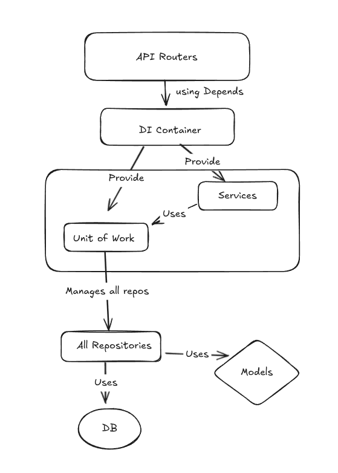
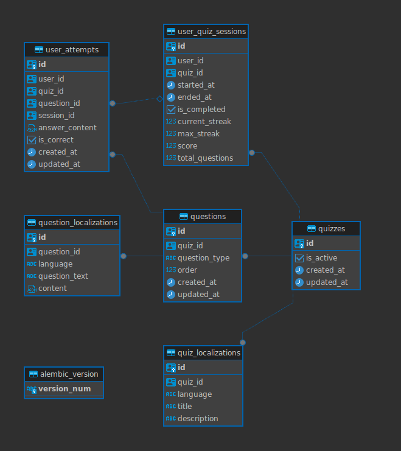
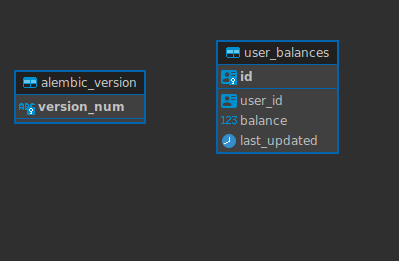

# Quiz App Backend

## Introduction
Welcome to the Quiz APP! This project is a microservice-based application designed to manage quizzes, handle user interactions, and maintain user balances. It leverages FastAPI for building high-performance APIs, SQLAlchemy for database interactions, and RabbitMQ for asynchronous event handling.
## Business Logic in Brief

- **Streak Calculation:**  
  Tracks consecutive correct answers; the streak increases with each correct answer, resets on mistakes, and influences bonus calculation.
  - On each correct answer, `current_streak` is incremented and `max_streak` is updated if the current streak exceeds the previous maximum.
  - A wrong answer resets the `current_streak` to zero.

- **Bonus Calculation:**  
  Awards additional points based on the number of correct answers and the current streak multiplier.
  - Base points are calculated as `new_correct_count * 100`.
  - A streak bonus is applied by increasing the total points based on the length of the current streak (e.g., a 10% increase per additional consecutive correct answer).

- **Unique Correct Answer Tracking:**  
  Ensures that virtual currency is awarded only for new correct answers.
  - The system tracks which questions the user has answered correctly across sessions.
  - Points are granted only for questions that the user answers correctly for the first time. Subsequent correct answers to the same question in later sessions do not yield additional rewards.

- **Percentile Ranking:**  
  On session completion, calculates the user’s performance relative to others, expressing it as a percentile.
  - The system compares the user’s score to those of other users who took the same quiz.
  - It calculates the percentage of users who scored lower, which is then displayed to the user (e.g., "You scored better than 89% of users on this quiz").

- **Event Handling:**  
  Upon quiz completion, an event is published to RabbitMQ, triggering balance updates in the Balance Service.
  - When a session finishes, an event containing the session results is published to the message queue.
  - The Balance Service listens for this event, processes the quiz completion details, and updates the user’s balance accordingly.

- **Localization Support:**  
  Quizzes and questions are localized in multiple languages (EN, ES, PT, DE, TR, FR).
  - Users can receive questions and content in their preferred language.
  - The system retrieves and serves localized content based on the language code provided in request headers.
  - Quiz localization in Test DB is available in 2 languages(EN, ES)

- **Question Type Handling:**  
  The system supports various question types including single choice, multiple choice, fill in the blanks, and matching pairs.
  - Each question type uses specialized logic for validating answers.
  - Dedicated endpoints and request schemas handle the submission of answers for different question types, ensuring appropriate processing and feedback.


## Technical Stack
- **Stack**: FastAPI, PostgreSQL, RabbitMQ, SQLAlchemy, Docker, Alembic

## Endpoints

### Quiz Endpoints  - http://127.0.0.1:9000/docs
- `GET /quizzes`: Retrieve all quizzes
- `POST /quizzes`: Create a new quiz

### Question Endpoints
- `POST /questions/{quiz_id}/add`: Add Questions to a Quiz
- `GET /questions/{quiz_id}`: Get Questions for a Quiz`
Question
### Answer Endpoints
- `POST /questions/{question_id}/answer`: Answer a Standard Question
- `POST /questions/{question_id}/answer-matching`: Answer a Matching  
### Quiz Sessions Endpoints
- `POST /quiz_sessions/start-session/{quiz_id}`: Start Quiz session
- `GET /quiz_sessions/{session_id}`: Get session info
- `POST /quiz_sessions/finish-session/{session_id}` Finish a quiz session


### Balance Service Endpoints - http://127.0.0.1:9001/docs
- `GET /users/{user_id}/balance`: Retrieve user balance

## Setup Instructions
1. **Clone the repository**:
     ```bash
     git clone <repository_url>
     cd quiz_app
     ```

3. **Up containers with Docker Compose**:
     ```bash
     docker-compose up --build
     ```
3. **Check Swagger**
    ```
    Balance Swagger - http://127.0.0.1:9001/docs
    Quiz Swagger - http://127.0.0.1:9000/docs
    ```
### ### Steps to Start and Finish a Quiz

Follow these steps to initiate a quiz session, answer questions, and complete the session seamlessly:

1. **Start Quiz Session**
   - **Endpoint:** `POST /quiz_sessions/{quiz_id}/start-session`
   - **Headers:**
     - `x-user-id`: UUID of the user starting the session.
   - **Description:** Initiates a new quiz session for the specified quiz and user. The response will include a session ID, which you'll use in subsequent steps.
   - **Request Example:**
     ```json
     {
       "quiz_id": "123e4567-e89b-12d3-a456-426614174000",
       "user_id": "987e6543-e21b-32d3-b654-426614174999"
     }
     ```
   - **Response Example:**
     ```json
     {
       "session_id": "abcdef12-3456-7890-abcd-ef1234567890",
       "quiz_id": "123e4567-e89b-12d3-a456-426614174000",
       "user_id": "987e6543-e21b-32d3-b654-426614174999",
       "total_questions": 10,
       "is_completed": false,
       "started_at": "2025-01-11T10:00:00Z"
     }
     ```

2. **Retrieve Quiz Questions**
   - **Endpoint:** `GET /questions/{quiz_id}`
   - **Headers:**
     - `x-language-code`: Language code for localization (e.g., `en`, `es`).
   - **Description:** Fetches all questions associated with the specified quiz, localized to the provided language.
   - **Request Example:**
     ```
     GET /questions/123e4567-e89b-12d3-a456-426614174000
     Headers:
       x-language-code: en
     ```
   - **Response Example:**
     ```json
     
     {
       "questions": [
         {
           "question_id": "q123",
           "question_type": "SINGLE_CHOICE",
           "question_text": "What is 2+2?",
           "content": {
             "public_data": {"options": [{"id": "opt1", "text": "6"}, {"id": "opt2", "text": "4"}, {"id": "opt3", "text": "9"}]},
             "private_data": {"correct_options": ["opt2"]}
           }
         },
         {
           "question_id": "q124",
           "question_type": "MATCHING",
           "question_text": "Match the functions to their descriptions.",
           "content": {
             "public_data": {
               "shuffled_left": ["len", "sorted", "type"],
               "shuffled_right": [
                 "Returns the number of items in an object",
                 "Returns a sorted list",
                 "Returns the type of an object"
               ]
             },
             "private_data": {
               "pairs": [
                 {"left": "len", "right": "Returns the number of items in an object"},
                 {"left": "sorted", "right": "Returns a sorted list"},
                 {"left": "type", "right": "Returns the type of an object"}
               ]
             }
           }
         }
         // More questions...
       ],
     }
     ```

3. **Submit Answers**
   - For each question retrieved in step 2, submit your answer using the appropriate endpoint based on the question type.

   - **If the Question Type is Single Choice, Multiple Choice, or Fill in the Blank:**
     - **Endpoint:** `POST /questions/{question_id}/answer`
     - **Headers:**
       - `x-language-code`: Language code (e.g., `en`).
       - `x-user-id`: UUID of the user.
     - **Description:** Submit an answer for standard question types.
     - **Request Example:**
       ```json
       {
         "session_id": "YOUR SESSION ID",
         "answer_content": {
           "selected_option": ["opt1"]
         }
       }
       ```
     - **Response Example:**
       ```json
       {
         "question_id": "q123",
         "is_correct": true,
         "feedback": "Correct!",
         "current_streak": 1,
         "max_streak": 1
       }
       ```

   - **If the Question Type is Matching Pairs:**
     - **Endpoint:** `POST /questions/{question_id}/answer-matching`
     - **Headers:**
       - `x-language-code`: Language code (e.g., `en`).
       - `x-user-id`: UUID of the user.
     - **Description:** Submit answers for matching pairs questions.
     - **Request Example:**
       ```json
       {
         "session_id": "YOUR SESSION ID",
         "answer_content": {
            "selected_option":{
            "matches": [
                {"left": "len", "right": "Returns the number of items in an object"},
                {"left": "sorted", "right": "Returns a sorted list"},
                {"left": "type", "right": "Returns the type of an object"}
              ]
            }
         }
       }
       ```
     - **Response Example:**
       ```json
       {
         "question_id": "q124",
         "is_correct": false,
         "feedback": "Wrong!",
         "current_streak": 0,
         "max_streak": 3
       }
       ```

   - **Feedback:**  
     After each answer submission, you will receive feedback indicating whether your answer was correct and an update on your current streak.

4. **Finish Quiz Session**
   - **Endpoint:** `POST /quiz_sessions/{session_id}/finish-session`
   - **Headers:**
     - `x-user-id`: UUID of the user finishing the session.
   - **Description:** Completes the quiz session, calculates results, and updates the user's balance.
   - **Request Example:**
     ```
     POST /quiz_sessions/abcdef12-3456-7890-abcd-ef1234567890/finish-session
     Headers:
       x-user-id: 987e6543-e21b-32d3-b654-426614174999
     ```
   - **Response Example:**
     ```json
     {
       "event_type": "QUIZ_COMPLETED",
       "session_id": "abcdef12-3456-7890-abcd-ef1234567890",
       "user_id": "987e6543-e21b-32d3-b654-426614174999",
       "current_streak": 3,
       "percentile": 75,
       "score": 300,
       "new_correct_answers": 2
     }
     ```


## Architecture Diagram (Example)



## ERD - Quiz Service


## ERD - Balance Service

